# Poverty

- **Poverty** is a state or condition in which a person or community lacks the financial resources and essentials for a minimum standard of living. Poverty   means that the income level from employment is so low that basic human needs can't be met. Poverty-stricken people and families might go without        proper housing, clean water, healthy food, and medical attention. 

- Children are more than twice as likely to live in poverty than adults. Children from the poorest households die at twice the rate of their better-off peers.


---
# Indicators of Poverty

According to Multidimensional Poverty Index which is specified in surveys of Sustainable Development Solutions Network (SDSN), there are 9 items that are indicators of poverty.  

1.	Adult or child malnourishment  
2.	Disrupted or curtailed schooling (a minimum of years 1-8)  
3.	The absence of any household member who has completed 6 years of schooling     
4.	Child mortality within the household within the last 5 years   
5.	Lack of access to safe drinking water     
6.	Lack of access to basic sanitation services      
7.	Lack of access to clean cooking fuel    
8.	Lack of basic modern assets (radio, TV, telephone, computer, bike, motorbike, etc.)    
9.	Lack of access to reliable electricity     


---


.pull-left[
# Aim of Project

-  This project aims to examine the living conditions, economic situation and educational status of children in the world. With this project, it is aimed to point out that **child poverty** is a huge problem for the world.

-  The project examines the connection of these problems with the level of development of the countries according to different data such as mortality, education, water services.


]

.pull-right[

```{r, echo=FALSE}
knitr::include_graphics("https://www.unicef.org/sites/default/files/styles/hero_mobile/public/UNI112437.jpg?itok=gJh6vbn0")
```
- The purpose of the project is achieved by transforming the relevant data into graphical information.
]
---
## Introduction to Data

- There are 3 basic data used in this project to detect child poverty.  

1. Mortality
2. Education
3. Water Services  

- Data was collected from UNICEF, an organization dedicated to reducing child poverty around the world. 

- The data show the situation of the countries according to the researches made according to certain years.    

- It can be can accessed the data from the reference section on the last page.


---

#Data Preparation 
```{r, eval=FALSE}
library(readxl)
# This library is used to import data to R.  

library(tidyverse)
library(tidyr)
library(dplyr)
# These libraries are used to manipulate data. 

library(ggplot2)
library(patchwork)
# These libraries are used to visualize data.  

library(sf)
library(leaflet)
# These libraries are used to use spatial data.
```

---

### Importing Data


```{r, eval=FALSE}
mortality<-read_excel("data/Table-2-Child-Mortality-EN.xlsx")
str(mortality)
```

```{r,eval=FALSE}
education<-read_excel("data/Table-10-Education-EN.xlsx")
```

```{r,eval=FALSE}
wash<-read_excel("data/Table-13-WASH-EN.xlsx")
```

```{r,eval=FALSE}
dev_data<-read_excel("data/comparedata.xlsx")%>%
  slice(-c(1))%>%     
  select("Development Regions")
```
---
# Dirty Data

```{r, echo=FALSE}

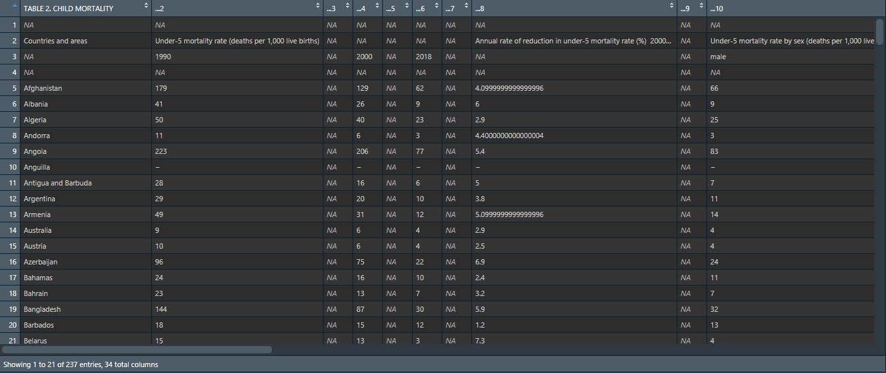
```


---

## Cleaning and Reshaping

The code that manipulates the mortality data is below 
```{r,eval=FALSE}
not_all_na <- function(mortality) any(!is.na(mortality))
  
mortality_tidy <-   
  mortality %>%   
  filter_all(any_vars(! is.na(.))) %>%
  select(where(not_all_na)) %>%       
  
  select(1:4|6:9|13:14) %>%       
  rename("Countries"="TABLE 2. CHILD MORTALITY",
         "Under_5_1990"="...2",
         "Under_5_2000"="...4",
         "Under_5_2018"="...6",
         "Under_5_male_rate_2018"="...10",
         "Under_5_female_rate_2018"="...12",
         "Infant_1990"="...14",
         "Infant_2018"="...16",
         "Dying_5_14_1990"="...24",
         "Dying_5_14_2018"="...26") %>%
         slice(c(3:204)) %>%
         mutate(dev_data,.after="Countries") 
```

---
# Tidy Data
```{r, echo=FALSE}
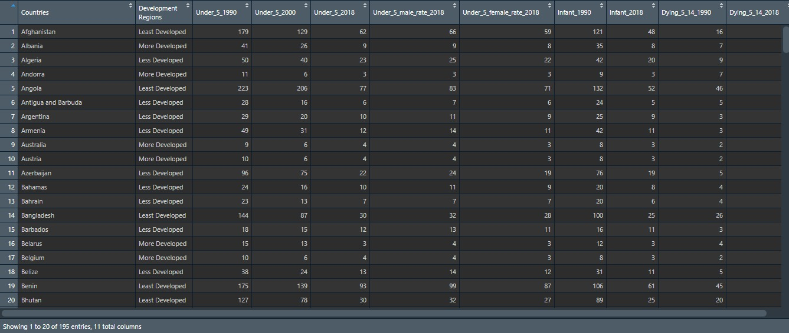
```

---
# Data Visualization

5 different types of graphics were used in this project.
- **The graphs used are:**   
    - Boxplot    
    - Pie Chart     
    - Scatter Graph  
    - Spatial Mapping
    - Bar Graph


---
## Boxplot Code

```{r,eval=FALSE,warning=FALSE}
graph_1990 <-
mortality_tidy %>%
  ggplot(aes(x=`Development Regions`,y=Under_5_1990)) +
  geom_boxplot(fill="#34967d") +
  labs(x = "Development Levels", y = "Deaths",
       title = "Under-5 Mortality Rate in 1990 (per 1000 live births)")+
   theme(axis.title =element_text(size = 15, color = "#ad4e4e", face = "italic"),
         axis.text = element_text(size = 11, color = "#616d77", face="bold"),
         plot.title = element_text(size = 15, color="#8f3d3e" ,face = "italic"),
         panel.background = element_rect(fill="coral"),
         plot.background = element_rect(fill="#cedfd5"))
 

graph_1990

```


---

class:center
## Boxplot


.pull-left[
```{r, echo=FALSE}
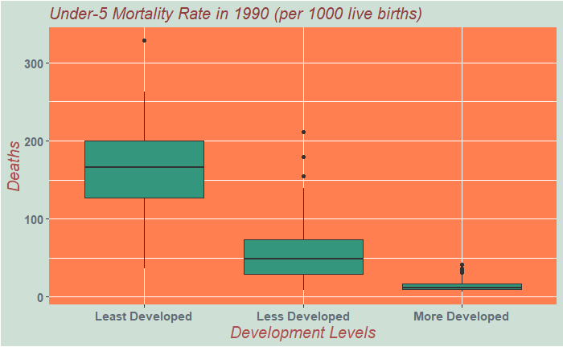
```
```{r, echo=FALSE}
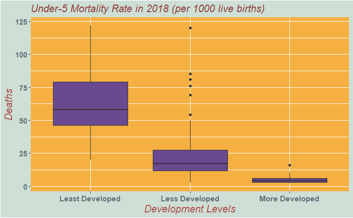
```


]
.pull-right[
```{r, echo=FALSE}
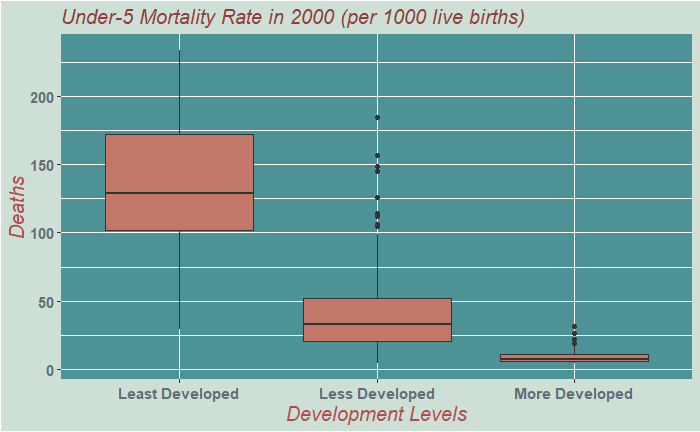
```

]

---


## PieChart Code

```{r,eval=FALSE}
pie1<-ggplot(mort_1,aes(x="",y=avg_Under_5_female,fill=`Development Regions`))+
  geom_bar(width=0.7,stat="identity")+
   labs(y="y", title="Mean of Under-5 Female Mortality" ,subtitle="(deaths per 1000 live births)")+
  theme(plot.title = element_text(size = 14, color="red",face = "bold" )) +
  geom_label(aes(label=avg_Under_5_female),
             position = position_stack(vjust = 0.5),
             show.legend = FALSE) +
  scale_fill_brewer(palette="PuRd")+
  theme_void() +
  coord_polar(theta = "y") 

#pie2 same

pie1+pie2
```

---

## PieChart

```{r, echo=FALSE}
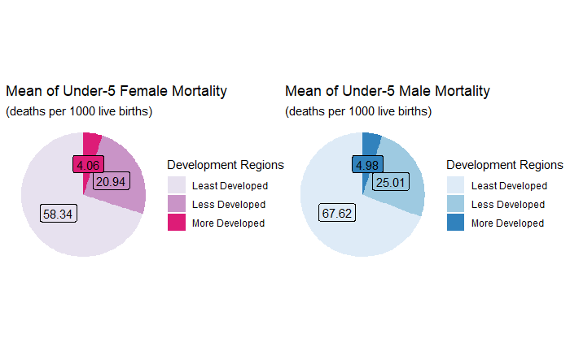
```


---
## Scatter Graph Code
```{r, eval=FALSE}
least_graph1<-
  mortality_tidy %>%
  filter(`Development Regions` == "Least Developed") %>%
  mutate(`Countries`=fct_reorder(`Countries`,Under_5_1990))%>%
  ggplot(aes(Under_5_1990,`Countries`))+
  labs(y="Least Developed Countries",x="Mortality Rate",
       title="Under-5 Mortality Rate in 1990",
       subtitle="(deaths per 1000 live)")+
  geom_point(color="turquoise4",shape=19) +
  theme(axis.text.x = element_text(size=11,face="bold",color="#aa5a4f"),
        axis.text.y = element_text(size=5,face="bold",color="#aa5a4f"),
        axis.line.x = element_line(color="black"),
        axis.line.y = element_line(color="black"),
        axis.title.y=element_text(color="darkslategrey"),
        axis.title.x=element_text(color="gray42"),
        plot.title=element_text(color="#407328",hjust=0.5,size=16),
        plot.subtitle=element_text(color="#407328",hjust=0.5,size=16),
        panel.background = element_rect(fill="#C8BA5B"),
          plot.background = element_rect(fill="#cedfd5"))+
  scale_x_continuous(breaks=seq(0,400,20))

least_graph1
```


---
## Scatter Plot
```{r, echo=FALSE,out.height='80%',out.width='100%'}
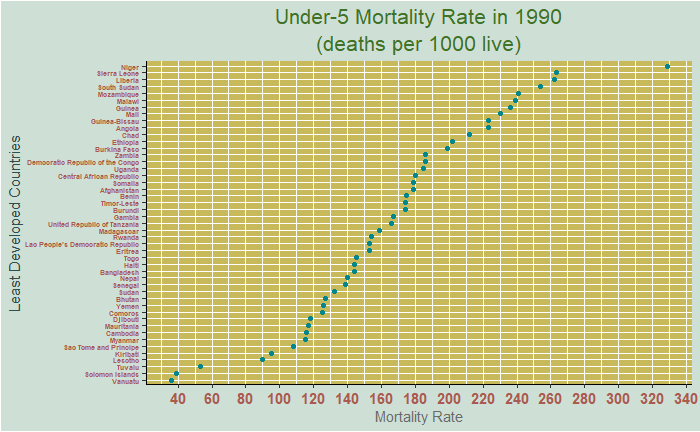
```

---
## Scatter Plot
```{r, echo=FALSE,out.height='80%',out.width='100%'}
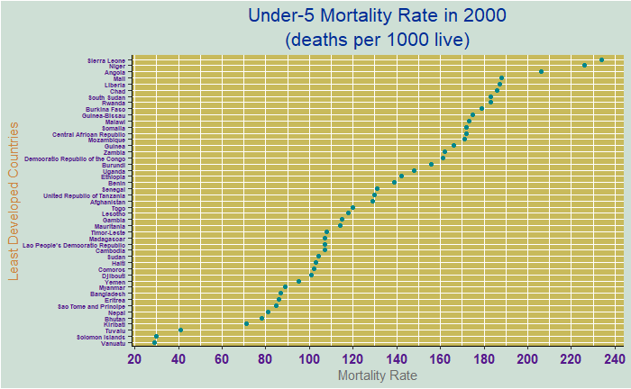
```
---
## Scatter Plot
```{r, echo=FALSE,out.height='80%',out.width='100%'}
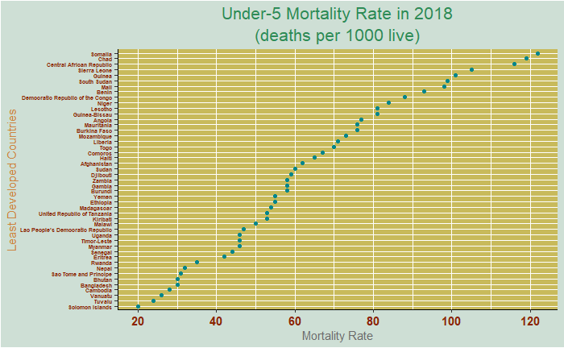
```
---
## Scatter Plot
```{r, echo=FALSE,out.height='80%',out.width='100%'}
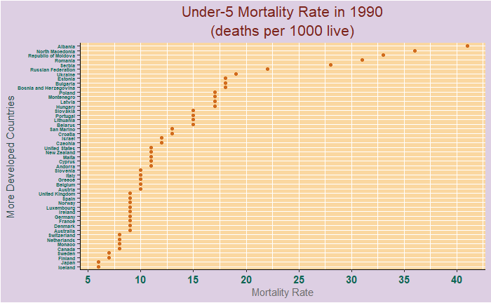
```
---
## Scatter Plot
```{r, echo=FALSE,out.height='80%',out.width='100%'}
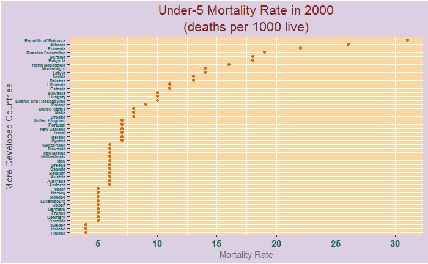
```
---
## Scatter Plot
```{r, echo=FALSE,out.height='80%',out.width='100%'}
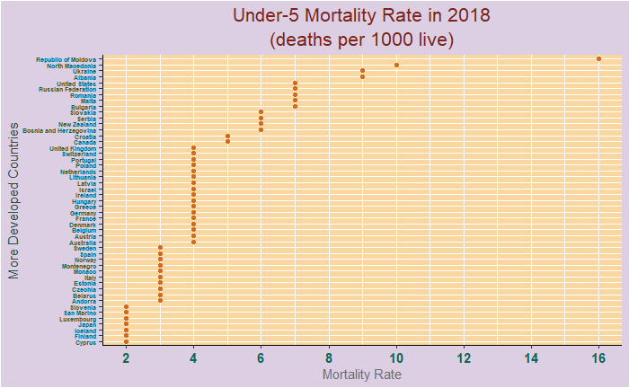
```

---


```{r,include=FALSE}
devtools::install_github("thomasp85/patchwork")
```

```{r,include=FALSE}
library(tidyverse)
library(tidyr)
library(dplyr)
library(readxl)
library(ggplot2)
library(patchwork)
library(sf)
library(rmarkdown)
library(leaflet)
```

```{r,include=FALSE}
dev_data<-read_excel("data/comparedata.xlsx")%>%
  slice(-c(1))%>%     ##This data is used to pull "development levels" data.
  select("Development Regions")
```

## Spatial Data


```{r, eval=FALSE} 
world_data<- st_read("data/world-administrative-boundaries.shp")
```

```{r, eval=FALSE}
world_data_1<-world_data %>%
  rename(Countries="name")
```


```{r, eval=FALSE}
world_data_2<-world_data_1 %>%
  select(Countries) %>%
  arrange(Countries)
```


```{r, eval=FALSE}
education_tidy <- education_tidy %>%
  arrange(Countries)
```


```{r, eval=FALSE}
merged_data_1<-merge(world_data_2,education_tidy)
```

---

## Spatial Mapping
```{r, eval=FALSE}
out_of_school_color <- colorFactor(
  palette=c("#025F06","#579C5A","#88A389"),
  domain= merged_data_1$`Development Regions`, 
  levels = c("More Developed","Less Developed","Least Developed"),
  ordered = TRUE)
```

```{r, eval=FALSE}
out_of_school_labels <-
  sprintf("<strong>%s</strong><br>%s<br>Out of School primary male: %s <br> Out of School primary female:%s",merged_data_1$Countries,merged_data_1$`Development Regions`,
          merged_data_1$Out_of_school_primary_male,
          merged_data_1$Out_of_school_primary_female) %>%
  lapply(htmltools::HTML)
```

```{r, eval=FALSE}
out_of_school_map <- merged_data_1 %>% leaflet() %>% 
  addPolygons
(stroke=TRUE,color = "white",weight = 1,label=out_of_school_labels,
              fillColor = ~out_of_school_color(`Development Regions`),
              fillOpacity = 0.7)
out_of_school_map
```
---
## Bar Graph Code

```{r,eval=FALSE,warning=FALSE}
wash_least_plot<-ggplot(wash_tidy_1,aes(reorder(Countries,Total_basic_drinking_water_services),
               Total_basic_drinking_water_services,
               fill=as.factor(Countries)))+
    geom_col(color="white")+
    theme_bw()+
    coord_flip(clip = "off", expand = FALSE)+
    guides( fill = FALSE) +
    labs(title="Total Basic Drinking Water Services for Least Developed Countires", 
         y="Total water services ", x="Least Developed Countries")+
     geom_text(fontface = "bold",color="#2B3D5D",size=3,aes(label = paste(Total_basic_drinking_water_services,"")), hjust = 1)+
    theme(
    plot.title=element_text(size=11, hjust=0.5, face="bold", colour="#A330D5", vjust=-1),
    axis.title.y=element_text(color="darkslategrey"),
    axis.title.x=element_text(color="#6E76F0"),
    panel.background = element_rect(fill="#EAF0DA"),
    plot.background = element_rect(fill="#B4F7C7"))
wash_least_plot
```

---

## Bar Graph


```{r, echo=FALSE,out.height='80%',out.width='100%'}
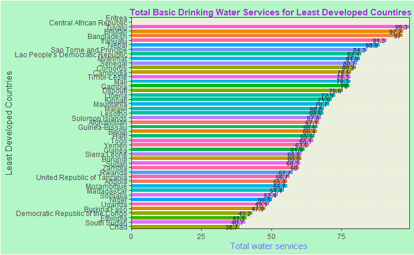
```
---

## Bar Graph


```{r, echo=FALSE,out.height='80%',out.width='100%'}
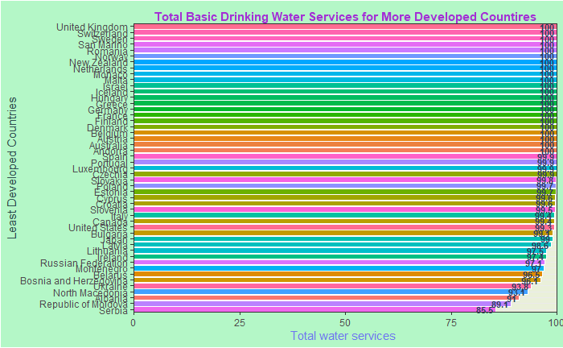
```


---

## Challenges

After clearing the data, the correct result for the graphs could not be obtained. Because, number values were available as character structure. The problem was fixed by doing the following actions.

```{r, eval=FALSE ,warning=FALSE}
mortality_tidy[,1] <- as.factor(unlist(mortality_tidy[,1]))
mortality_tidy[,2] <- as.factor(unlist(mortality_tidy[,2]))
mortality_tidy[,3] <- as.numeric(unlist(mortality_tidy[,3]))
mortality_tidy[,4] <- as.numeric(unlist(mortality_tidy[,4]))
mortality_tidy[,5] <- as.numeric(unlist(mortality_tidy[,5]))
mortality_tidy[,6] <- as.numeric(unlist(mortality_tidy[,6]))
mortality_tidy[,7] <- as.numeric(unlist(mortality_tidy[,7])) 
mortality_tidy[,8] <- as.numeric(unlist(mortality_tidy[,8]))
mortality_tidy[,9] <- as.numeric(unlist(mortality_tidy[,9]))
mortality_tidy[,10] <- as.numeric(unlist(mortality_tidy[,10]))
mortality_tidy[,11] <- as.numeric(unlist(mortality_tidy[,11]))
```
---
## Conclusion 

- It has been worked on mortality, education and water data.

- Importing, cleaning, mutating, reshaping and visualization steps were applied.

- In addition to the interim report, education and water data were analyzed.

## Results
- As a result, child poverty is a worldwide problem.

- Based on the data, it can be said that poverty in developed countries is much less than in underdeveloped countries.

---
## References

[1] [UNICEF Table](https://data.unicef.org/resources/dataset/sowc-2019-statistical-tables/)

[2] [Spatial Data](https://public.opendatasoft.com/explore/dataset/world-administrative-boundaries/export/)

[3] [UNICEF Data Warehouse](https://data.unicef.org/resources/data_explorer/unicef_f/?ag=UNICEF&df=GLOBAL_DATAFLOW&ver=1.0&dq=.ED_15-24_LR..&startPeriod=2016&endPeriod=2022)

[4] [UNICEF Research](https://data.unicef.org/topic/child-poverty/overview/) 

[5] [Graph Implementations](https://ivelasq.rbind.io/blog/other-geoms/)

[6] [Solution of Poverty](https://cpag.org.uk/child-poverty/solutions-poverty)

[7] [Slides with Rmarkdown](https://www.youtube.com/watch?v=3n9nASHg9gc)

